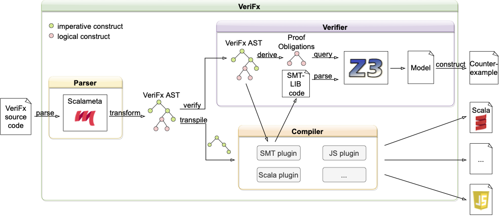

# Overview of VeriFx's Internal Structure

This folder contains the implementation of the VeriFx language.\
VeriFx's architecture is depicted below:

We briefly document the implementation's internal structure below:

- The `Compiler/ProjectCompiler` defines several methods to compile and run VeriFx projects.
First, you need to create a `ProjectCompiler` instance for your project. 
This can be done by calling the `ProjectCompiler.apply(files)` static method with a set of all VeriFx files in your project.
You can also use our `Utilities/Scanner` to search for all VeriFx files in your project (see the `Prover` object in the [templates](../templates/macOS/src/main/scala/Prover.scala)).
Once you created a `ProjectCompiler` instance you can use the `printProofs`, `checkProofs`, `checkProof`, and `checkProofForModel` methods:
  - `printProofs()` runs all proofs and prints the result to the console.
  - `checkProofs()` runs all proofs and returns a map containing the verification results.
  - `checkProof()` verifies a given proof and returns the proof result.
    If the proof is rejected you cannot query the counterexample.
  - `checkProofForModel()` same as `checkProof` but allows you to fetch the counterexample by calling `counterExample()` on the proof result if it is rejected.
- We leverage scala-meta to parse the source code into an AST
- Then `VeriFx2IRCompiler` file contains several compilers to compile the AST of classes, objects, traits, etc. to an Intermediate Representation (IR)
- Then `IR2LanguageCompiler` compiles the IR to a concrete language. To this end, it uses a compiler plugin for the target language.
  - Note: the compilers are implemented using the state monad where the necessary information (class tables, etc.) is the state and the compiler may modify this state and returns the compiled expression
- `Compiler/Plugin.scala` defines the `Plugin` trait that a compiler plugin must implement in order to support a new target language.
Concrete compiler plugins can be found under `Compiler/Plugins`.
Currently, there are compiler plugins for JavaScript, Scala, and Z3.
These plugins generate the actual JavaScript/Scala/Z3 code from the IR.
- `Analysis/Z3Prover` takes a compiled Z3 program and discharges it using Z3
- `Analysis/ModelReconstructor` contains utilities to turn counter examples returned by Z3 into high-level VeriFx counterexamples
